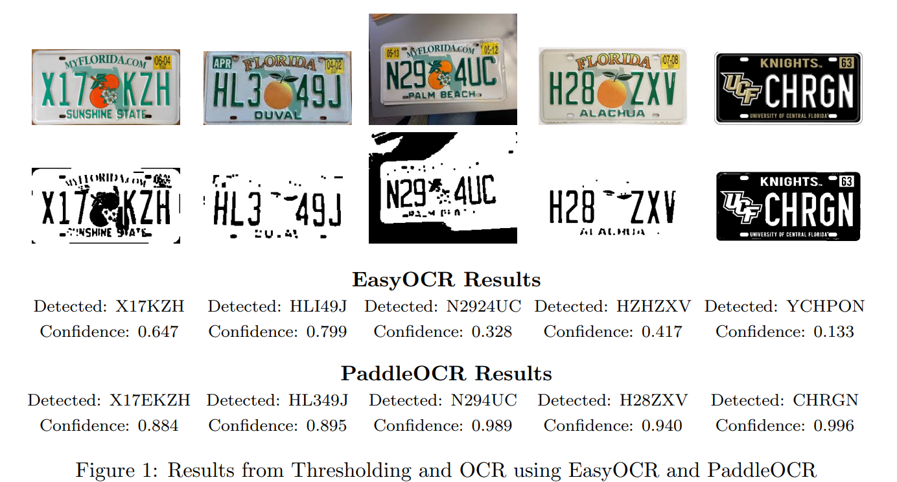

# Real-Time License Plate Detection

## Description
This project uses YOLOv11 to detect license plates in a video and OCR to identify the plate number.

## Table of Contents

- [Getting Started](#getting-started)
- [Running The Code](#running-the-code)
- [Dataset](#dataset)
- [OCR and Thresholding](#ocr-and-image-thresholding)
- [Reflection](#reflection)

## Getting Started

1. Clone the repository: `git clone https://github.com/tkjonesy/Real-Time-License-Plate-Detection.git`
2. Install the required packages:   `pip install -r requirements.txt`
3. In main.py be sure to set video file or capture device:   `cap = cv2.VideoCapture('test-media/videotest.mp4')`

## Running the Code
1. Run `main.py`

## Dataset

For this task, I used the [License Plate Recognition Dataset](https://roboflow.com/dataset/license-plate-recognition-rxg4e) from Roboflow. This dataset contains over 10,000 images with a train:valid:test split of 70:20:10. 

Before feeding the data to YOLO, I artificially increased the size of the dataset using the following techniques from [Albumentations](https://albumentations.ai/docs/):

- **HorizontalFlip:** Flips the image horizontally.
- **RandomBrightnessContrast:** Adjusts the brightness and contrast of the image.
- **VerticalFlip:** Flips the image vertically.
- **Blur:** Applies a blur with a limit of up to 7 pixels.
- **GaussNoise:** Adds random Gaussian noise to the image.

## OCR and Image Thresholding

A significant challenge for this project was accurately reading the plate text from the detected license plate. To address this, I applied various thresholding techniques to isolate the plate text effectively. Below is a summary of the techniques I rigorously tested:

- **Grayscale conversion:** Simplifies the image by removing color.
- **Resizing:** Standardizes input dimensions.
- **Morphological operations:** Cleans noise and refines text edges.
- **Binary thresholding:** Converts pixels above the threshold to white and others to black.
- **Inverse binary thresholding:** Inverts the binary threshold result.
- **Truncate thresholding:** Caps pixel values above the threshold.
- **To-zero thresholding:** Keeps pixel values above the threshold, setting others to 0.
- **Inverse to-zero thresholding:** Keeps pixel values below the threshold, setting others to 0.
- **Otsu thresholding:** Automatically determines the optimal threshold value.

I struggled to get consistent and accurate results using [EasyOCR](https://github.com/JaidedAI/EasyOCR), even with what I think are strong binarized images. In the end, I pivoted to [Paddle OCR](https://github.com/PaddlePaddle/PaddleOCR), and was able to get amazing results without even using thresholding. This came at a higher computational cost, but applying basic thresholding may help with this cost.

## Reflection

The project was a mixed bag of successes and challenges. The YOLO model performed exceptionally well, achieving high metrics right from the start. Through a series of experiments, I was able to improve misclassifications by adding background images and increasing the dataset size. While my last model provided the best results, it still did not completely solve the background misclassification issue. This suggests that further experimentation, possibly with even more diverse and contextually relevant background images, could help the model generalize better. Overall, I’m very happy with the detection aspect of this project.

The OCR side of the project, looked doomed early on. Despite implementing various thresholding and preprocessing techniques, EasyOCR consistently struggled to accurately read plate text, even in what should have been ideal conditions. While EasyOCR showed some promise with plates that were cleanly captured and centrally positioned, the results were far too inconsistent for practical use. Thankfully, Paddle OCR came to the rescue with significant improvements in the accuracy in reading plate text. As stated above, This came at the cost of more expensive computation, but I think this can be reduced significantly by adjusting the thresholding and reducing the number of frames run through the OCR.

Moving Forward, I would like to mess with the OCR pipeline to reduce the time needed to process each frame, but overall I'm very happy with the results I was able to produce.
